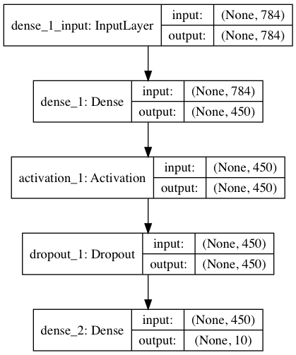

# Feed-Forward Network

## Architecture
This network architecture is designed using 2 dense layers with a sigmoid activation of layer 1 and dropout. It uses the Adam optimizer with a reduced learning rate to best fit the training data.

Here is a visualization of the model:

## Best Configuration
The best configuration of hyperparameters I found for this architecture are as follows:
* epochs = 4
* batch size = 10
  * chosen because on average we expect 1 of each digit to appear in a batch
* probability of dropout = 0.3
* hidden layer 1 size = 450
* Adam optimizer with learning rate = 0.005

## Results
The best results found from this configuration and architecture were 97.34% accuracy on the MNIST dataset.
