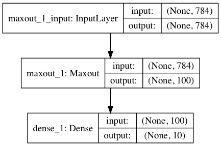

# Feed-Forward Network

## Architecture
This network architecture is designed simply, using 1 layer of maxout neurons followed by a dense-softmax layer. I designed an extension to Keras for a Maxout neuron layer for this demo.

The Maxout neuron was first imagined in a [paper](https://arxiv.org/abs/1302.4389) by Ian Goodfellow.

This project uses the Adam optimizer with a larger learning rate to best fit the training data. I chose the larger learning rate to maximize the discrepency between the competing inputs to the max operator within each neuron. This allowed the network to take better advantage of the "subnetworks" within.

Here is a visualization of the model:

## Best Configuration
The best configuration of hyperparameters I found for this architecture are as follows:
* epochs = 5
* batch size = 40
  * chosen because on average we expect 4 of each digit to appear in a batch
* hidden layer 1 size = 50
* Adam optimizer with learning rate = 0.0005

## Results
The best results found from this configuration and architecture were 97.28% accuracy on the MNIST dataset.
